# TacticalMR

Multiplayer soccer simulation system built in Unity that integrates with Scenic for automated scenario generation and demonstration recording. The system supports VR headsets, desktop observers, and AI-controlled players in a networked environment.

## Table of Contents

- [Architecture Overview](#architecture-overview)
- [Core Systems](#core-systems)
- [Player Systems](#player-systems)
- [Game Objects](#game-objects)
- [Data Flow](#data-flow)
- [Network Architecture](#network-architecture)
- [File Structure](#file-structure)
- [Getting Started](#getting-started)

## Architecture Overview

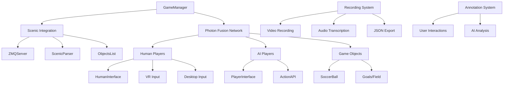

## Core Systems

### 1. Game Management (`GameManager.cs`)
Central coordinator that handles:
- **Network Mode Detection**: Automatically determines host/client roles
- **Platform Support**: VR headset (host) + laptop observer (client) + laptop-only mode
- **Photon Fusion Integration**: Multiplayer networking setup
- **Component Initialization**: Scenic communication and camera management

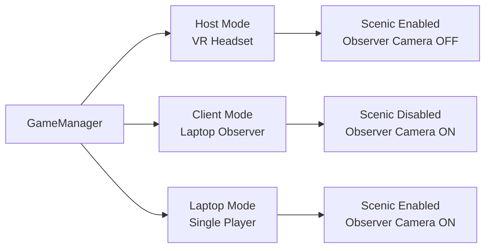

### 2. Scenic Integration
Connects Unity with external AI simulation system:

#### ZMQ Communication (`ZMQServer.cs`, `ZMQRequester.cs`)
- **Bidirectional Communication**: Unity ↔ Scenic AI system
- **JSON Protocol**: Structured data exchange
- **State Synchronization**: Real-time game state sharing

#### Scenic Parser (`ScenicParser.cs`)
- **Object Creation**: Spawns players, balls, goals from Scenic commands
- **Action Translation**: Converts Scenic actions to Unity method calls
- **Coordinate System**: Transforms between Scenic and Unity coordinate systems

### 3. Timeline & Recording (`TimelineManager.cs`, `ProgramSynthesisManager.cs`)
- **Segment Recording**: Start/stop demonstration capture
- **Pause Control**: Timeline manipulation for annotations
- **Video Integration**: Automated video recording during segments
- **Rewind System**: TODO: Future implementation for playback

## Player Systems

### Human Players (`HumanInterface.cs`)

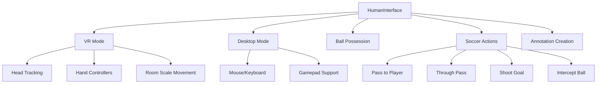

**Key Features:**
- **Cross-Platform Input**: VR controllers, keyboard/mouse, gamepad
- **Ball Physics**: Possession detection, passing mechanics
- **Action Logging**: Automatic annotation of player actions
- **Network Synchronization**: State sharing across clients

### AI Players (`PlayerInterface.cs`)

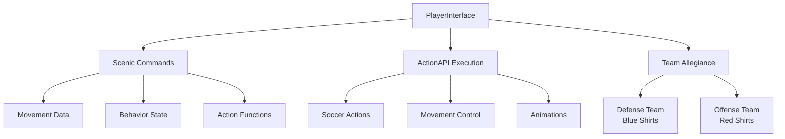

**Capabilities:**
- **Scenic Control**: Receives movement and action commands from AI
- **Pathfinding**: AI navigation using A* pathfinding
- **Team Coordination**: Automatic passing and positioning
- **Behavior Display**: Visual feedback of current AI state

### Action System (`ActionAPI.cs`)

Central hub for all player actions:

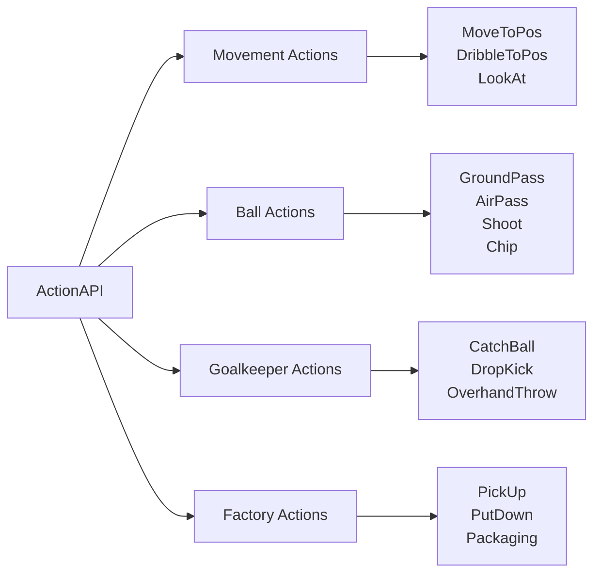

## Game Objects

### Soccer Ball (`SoccerBall.cs`)
Advanced physics system with intelligent movement:

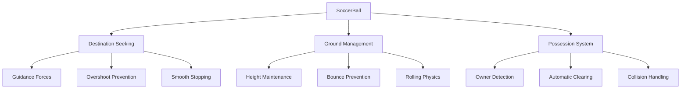

### Visual Systems
- **Arrow Generator** (`ArrowGenerator.cs`): Procedural 3D arrows for direction indication
- **Ground Selection** (`GroundSelection.cs`): Interactive position marking
- **FSM Visualizer** (`FSMVisualizer.cs`): State machine diagram rendering

## Data Flow

### Recording Pipeline

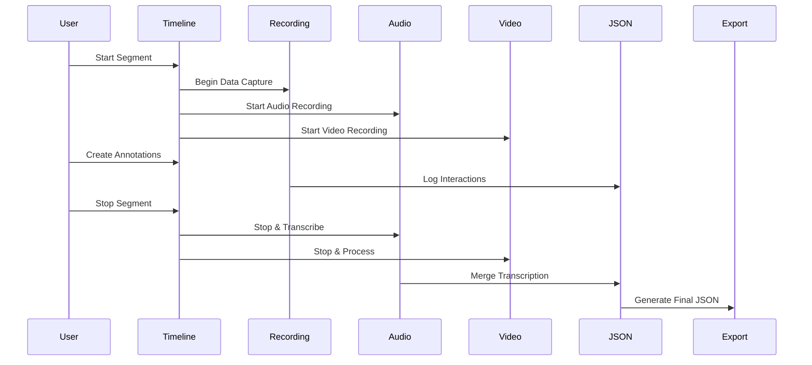

### Annotation System (`AnnotationManager.cs`)

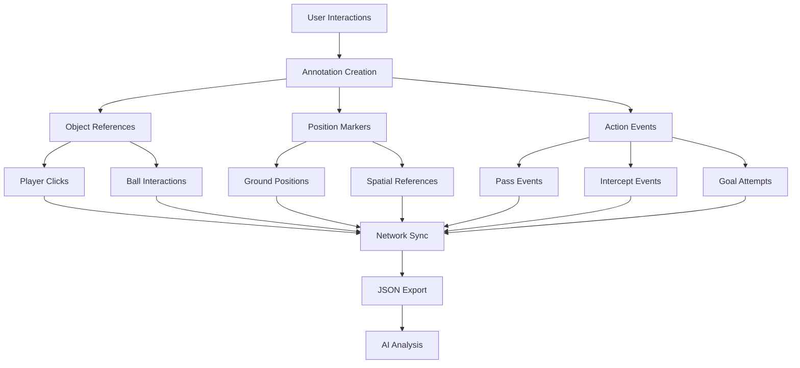

## Network Architecture

### Multiplayer Synchronization

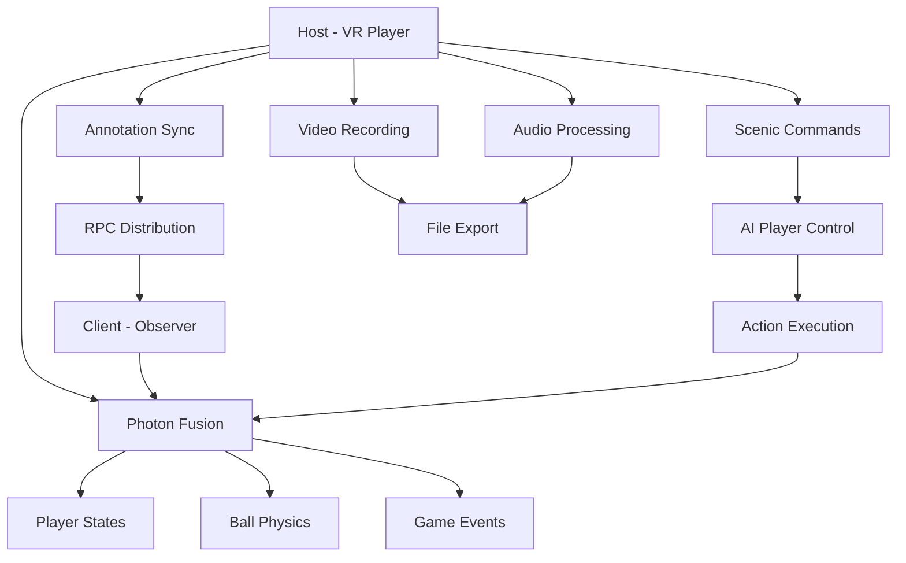

### Data Synchronization (`JSONToLLM.cs`)

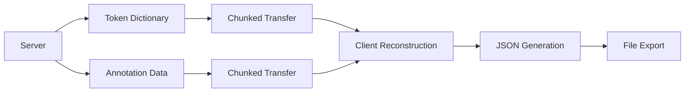

## File Structure

### Core Script Organization

```
Scripts/
├── Environment/
│   ├── Rewindable.cs               # Pause/resume functionality
│   ├── Fade.cs                     # VR transition effects
│   └── ScenarioManager.cs          # Scenario type management
│
├── FSM/
│   └── FSMVisualizer.cs            # State machine diagrams
│
├── Human/
│   ├── HumanInterface.cs           # Human player controller
│   ├── ControllerInput.cs          # Gamepad support
│   ├── KeyboardInput.cs            # Desktop input handling
│   └── ExitScenario.cs             # VR interaction controls
│
├── Input/
│   └── (Input-related scripts)     # Additional input handling
│
├── LLM/
│   ├── JSONToLLM.cs                # Data export to JSON
│   ├── JSONDirectory.cs            # File organization
│   └── JSONStatusMaker.cs          # Game state serialization
│
├── Multiplayer/
│   ├── GameManager.cs              # Main game coordinator
│   ├── PlayerInterface.cs          # AI player controller
│   ├── HumanInterface.cs           # Human multiplayer interface
│   ├── BallInterface.cs            # Ball networking
│   ├── GoalInterface.cs            # Goal networking
│   ├── LineInterface.cs            # Field marking networking
│   ├── ObjectsList.cs              # Scene object management
│   └── BallOwnership.cs            # Ball possession tracking
│
├── Program Synthesis/
│   ├── ProgramSynthesisManager.cs  # Recording coordination
│   ├── AnnotationManager.cs        # User interaction tracking
│   └── RecorderManager.cs          # Video recording
│
├── Scene Management/
│   ├── TimelineManager.cs          # Timeline and pause control
│   └── (Scene management scripts)
│
├── Scenic/
│   ├── ZMQServer.cs                # Scenic communication server
│   ├── ZMQRequester.cs             # ZMQ network handler
│   ├── RunAbleThread.cs            # Background thread base
│   ├── ScenicParser.cs             # JSON command parsing
│   ├── ScenicMovementData.cs       # Movement data structures
│   ├── InstantiateScenicObject.cs  # Object spawning
│   ├── IObjectInterface.cs         # Scenic control interface
│   └── ActionAPI.cs                # Player action execution
│
└── UI/
    ├── GroundSelection.cs          # Position marking
    ├── GroundDeselection.cs        # Position clearing
    ├── ArrowGenerator.cs           # 3D arrow generation
    └── SoccerBall.cs               # Advanced ball physics
```

### Scene Hierarchy Structure

```
zmq_demo_controller_main/
├── Managers/
│   ├── ZMQManager                  # Scenic communication
│   ├── VideoRecorderManager        # Video recording system
│   ├── ScenarioManager             # Scenario control
│   ├── MultiplayerManager          # Network coordination
│   ├── TimelineManager             # Timeline control
│   ├── Program Synthesis Manager   # Recording workflow
│   └── AudioRecorder               # Audio capture
│
├── Camera                          # Main camera system
├── Real Canvas                     # Main UI system
├── Field Components/
│   ├── extended ground             # Ground interaction
│   └── field                       # Soccer field
│
├── Interfaces/
│   ├── GPT Interface               # AI communication
│   ├── ScenicSynth                 # Scenic synthesis (UNUSED)
│   └── SynthConnect                # Connection management (UNUSED)
│
├── Input Management/
│   ├── keyboard                    # Keyboard input
│   └── EventSystem                 # Unity event system
│
├── UI Systems/
│   ├── Save Demonstration Canvas   # Demo saving UI
│   ├── GroundHighlight            # Position markers
│   ├── Buttons Canvas             # Control buttons
│   └── FSMSystem/
│       ├── FSMCanvas              # State machine UI
│       └── FSMVisualizer          # FSM diagram display
│
└── Utilities/
    ├── Axis Labels                # Debug visualization
    └── Grid                       # Scene grid
```

### Output Organization (`JSONDirectory.cs`)

```
output/
├── participant1/
│   └── Test/
│       ├── demonstration0/
│       │   ├── videos/
│       │   │   └── participant1_demo0_segment0.mp4
│       │   └── json_segments/
│       │       └── participant1_demo0_segment0.json
│       └── usable_demonstrations.json
└── system_recordings/
    └── transcript0/
        ├── demonstration0/
        └── usable_demonstrations.json
```

### JSON Data Format

```json
{
  "scene": {
    "id": "drill_name",
    "language": "transcribed_explanation",
    "step": 0.02,
    "objects": [
      {
        "id": "player_name",
        "type": "Teammate|Opponent|Coach",
        "position": [{"x": 0, "y": 0}],
        "velocity": [{"x": 0, "y": 0}],
        "ballPossession": [true, false],
        "behavior": "current_behavior"
      }
    ],
    "annotations": [
      {
        "id": "0",
        "type": "Pass",
        "from": "player1",
        "to": "player2"
      }
    ],
    "tokens": {
      "1.5": ["The", "player", "[0]", "passes"],
      "3.2": ["to", "teammate", "[1]"]
    }
  }
}
```

## Getting Started

### Prerequisites
- Unity 6.0.x LTS or later (Currently using 6.0.33f1)
- Scenic 3

### Setup
- Complete setup and installation instructions here: https://docs.google.com/document/d/1d0ErVx8w58e4359or7g-fBZrm-HRHs2ZPT3zxF9jCNg/edit?usp=sharing

For more documentation, click here (WIP): https://docs.google.com/document/d/1qMuEYCB1tztLdYwF7BSN8K2Y1f2QmMxFVMbeIjhTTsg/edit?tab=t.0

#### The main scene to run for desktop is `zmq_demo_controller_main.unity`. For VR it is `zmq_demo_vr.unity`. Enable/Disable the FSMSystem gameobject to hide/unhide the FSM diagram.

### Usage Modes

#### VR Host + Desktop Observer
```
VR Player (Host): Wears headset, controls game, interacts with AI
Desktop Observer (Client): Watches remotely, no direct control, records video/scene information
```

#### Laptop-Only Mode
```
Single Player: Desktop controls, observer camera, Scenic integration, supports both kbm & controller
```

### Key Controls

#### KBM (Note not all functionality is supported on KBM)
- **WASD**: Movement
- **P**: Pause/Unpause
- **E**: Restart scenario
- **B**: Start/Stop recording segment
- **Mouse**: Interact with objects and ground

#### Game Controller Controls
- **Left Joystick**: Movement
- **A Button**: Pause/Unpause
- **Y Button**: Restart scenario  
- **X Button**: Start/Stop recording
- **Left Trigger**: Intercept Ball
- **Right Trigger**: Pass
- **Left Shoulder**: Trigger Pass (Calling for teammate with ball to pass)
- **Right Shoulder**: Shoot to Goal

#### VR Controls
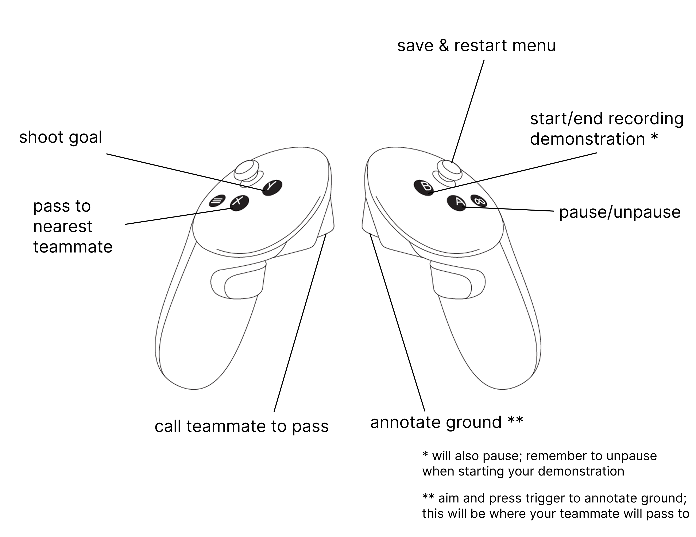

### Development Notes

- **Coordinate Systems**: Scenic uses (x,y,z) where z=up, Unity uses (x,y,z) where y=up
- **Network Authority**: Host controls Scenic and game state, clients observe
- **File Naming**: Can rename recording saves in ZMQManager gameobject, JSON Directory component.
