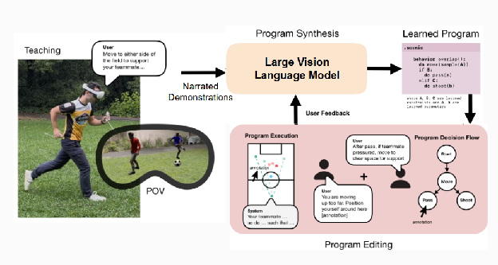
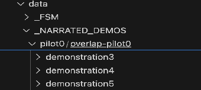
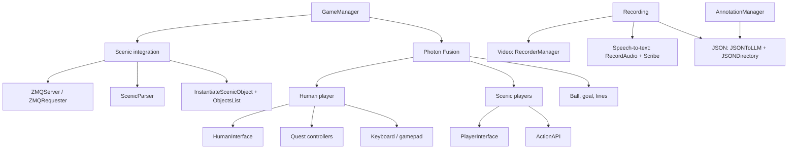
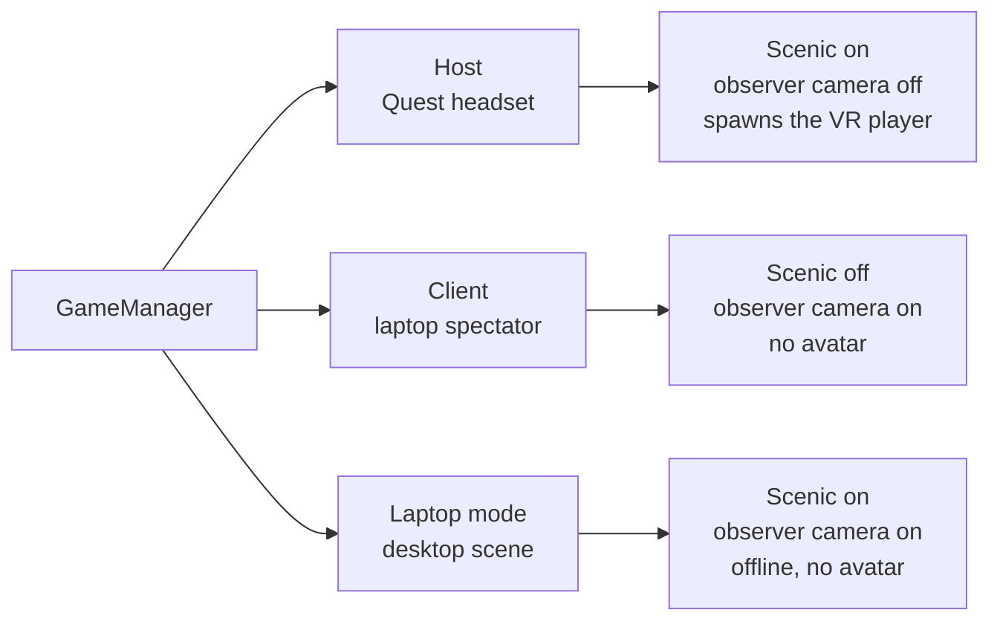
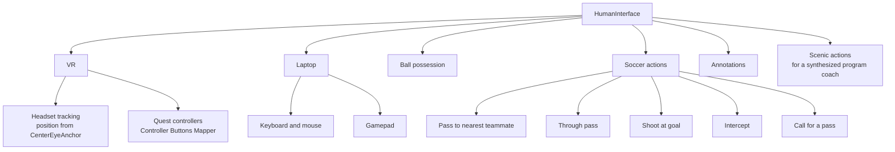
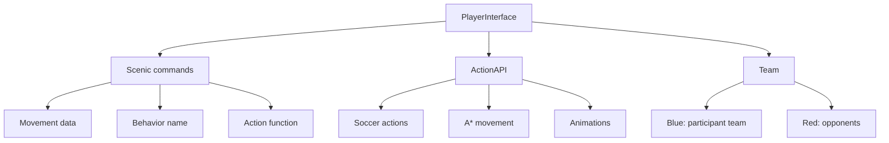
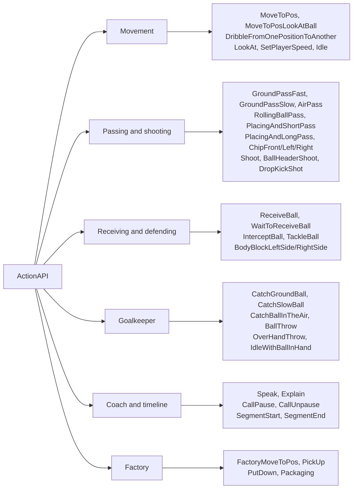
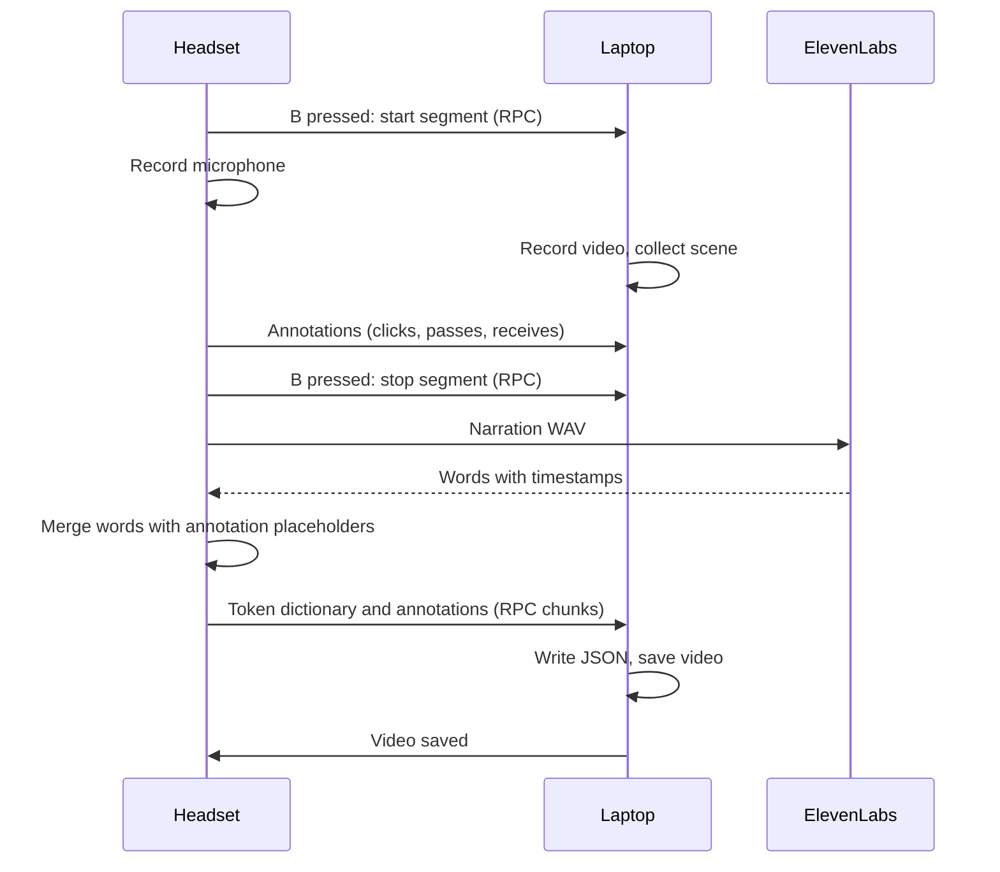
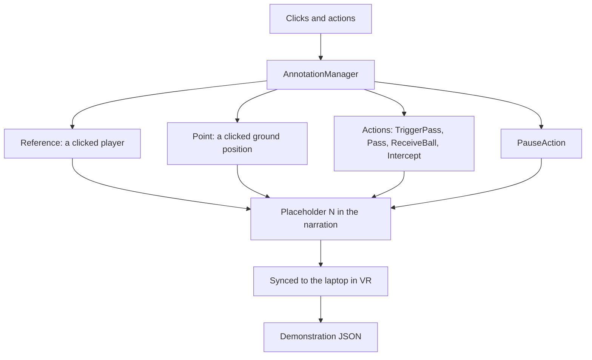
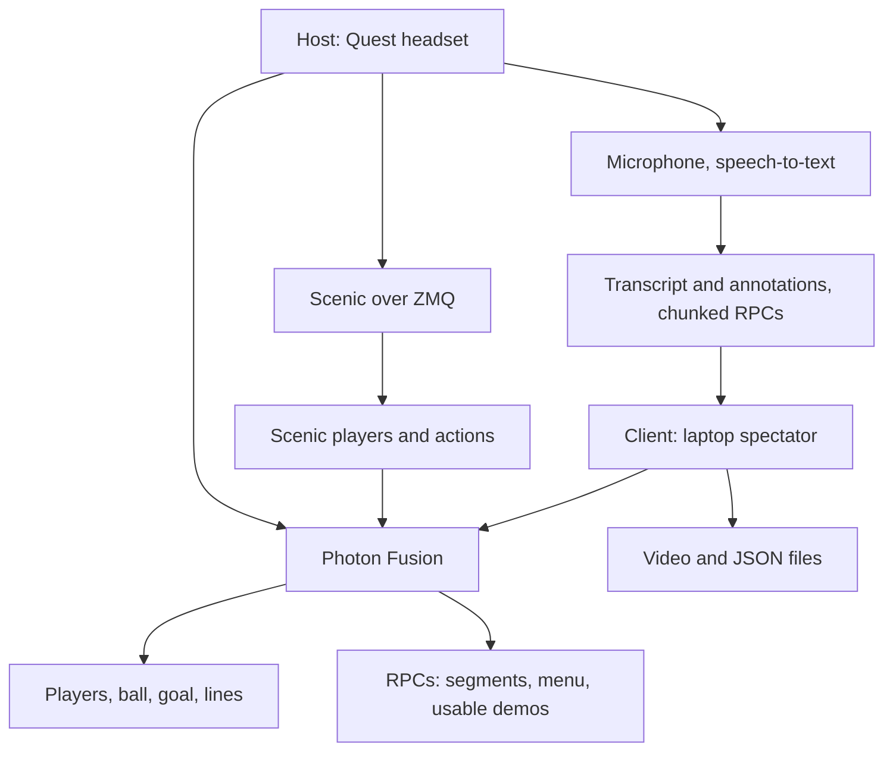

# TacticalMR



TacticalMR turns narrated demonstrations of soccer tactics into programs. A participant plays a [Scenic](https://scenic-lang.readthedocs.io/) scenario in mixed reality on a Meta Quest 3 and explains what they are doing. A laptop records the session. The [narrated_demo](https://github.com/ek65/narrated_demo) pipeline then synthesizes a Scenic program from the recordings. Finally, the participant reviews the program as a finite-state machine (FSM) and as a running simulation, and gives feedback.

The soccer study runs in one Unity 2022.3.13f1 project, with a scene for each part:

| Part of the study | Scene | Runs on |
|---|---|---|
| Record narrated demonstrations | `Assets/Scenes/zmq_demo_vr.unity` | Quest 3 (host) and the laptop's Unity Editor (spectator, records) |
| View the FSM and record feedback; run synthesized programs | `Assets/Scenes/zmq_demo_controller.unity` | Laptop's Unity Editor only (offline) |
| View the final program in VR | `Assets/Scenes/zmq_demo_vr_viewer.unity` | Quest 3 |

To run the factory setup, switch to the `factory` branch; see [Factory study](#factory-study).

User study tutorial: [overview_tutorial3.mp4](https://drive.google.com/file/d/1Fyzr8lflQ9z49QNBZYxYfmKwWahcZ54M/view?usp=drive_link)

## Contents

- [Setup and installation](#setup-and-installation)
- [Running the soccer study](#running-the-soccer-study)
- [Controls](#controls)
- [Troubleshooting](#troubleshooting)
- [Factory study](#factory-study)
- [Architecture](#architecture)

## Setup and installation

### 1. Get the repositories

1. Clone this repository with an [SSH key](https://docs.github.com/en/authentication/connecting-to-github-with-ssh/generating-a-new-ssh-key-and-adding-it-to-the-ssh-agent), or with [GitHub Desktop](https://desktop.github.com/):
   ```bash
   git clone git@github.com:ek65/TacticalMR.git
   ```
2. Clone [narrated_demo](https://github.com/ek65/narrated_demo) (ask the lab for access) and check out its `soccer-vr` branch.

### 2. Install Scenic

Install the Scenic in this repository (`Scenic-main`, version 3.0.0b2), not upstream Scenic. It has dependencies, such as the Unity simulator, that base Scenic doesn't.

1. Make sure Python 3.8 or newer is installed: `python --version`
2. Create and activate a virtual environment (venv or conda), then run `python -m pip install --upgrade pip`. More information is in the [Scenic quickstart](https://scenic-lang.readthedocs.io/en/latest/quickstart.html); select your operating system there.
3. `cd TacticalMR/Scenic-main`
4. `python -m pip install -e .`
   - If you run into an issue with `python-fcl`, you may have to install it manually. On an Apple Silicon Mac:
     1. Go outside the TacticalMR repository.
     2. Follow [Installing python-fcl on Apple Silicon](https://scenic-lang.readthedocs.io/en/latest/install_notes.html#installing-python-fcl-on-apple-silicon). You should be in the `python-fcl` folder after cloning it.
     3. `cd TacticalMR/Scenic-main` and run `python -m pip install -e .` again.
5. Check the install: `scenic --version` should print 3.0.0b2.

### 3. Set up Unity

1. Install [Unity Hub](https://unity.com/download), then Unity **2022.3.13f1** from the [editor archive](https://unity.com/releases/editor/archive) with the **Android Build Support** module. Use 2022.3.13f1 exactly. Unity 2022.3.21+ fixes an A* bug (see [Troubleshooting](#troubleshooting)) but hasn't been tested with this project.
2. In Unity Hub, click **Add → Add project from disk** and select the `TacticalMR/UnityProject` folder. Open it.
3. Go to **File → Build Settings** and click **Switch to Android**.
4. In the **Game** tab, open the resolution dropdown (Free Aspect by default), click **+** and create a **1200 × 1080** resolution. Select it.
5. In the **Console**, make sure **Error Pause** is off.
6. API keys:
   - **OpenAI**: in the Project window, go to `Assets/Resources`, select **OpenAIConfiguration**, and paste your key into **Api Key** in the Inspector. The coach in synthesized programs speaks through OpenAI.
   - **ElevenLabs** (speech-to-text for narrations and feedback): select the **Scribe** object in each scene and set **Eleven Labs Api Key**.
7. For Quest builds only, set the publishing settings: go to **Edit → Project Settings → Player** and scroll down to **Publishing Settings**.
   - **Project Keystore**: `UnityProject/key.keystore`. The keystore password is in the lab's setup document.
   - **Project Key**: alias `tactical` (create an alias called `tactical` if it isn't there). The key password is in the lab's setup document.

### 4. Test Scenic with Unity on the laptop

A scene takes input from Scenic as long as it has the **ZMQManager** object with its components.

1. Open `Assets/Scenes/zmq_demo_controller.unity` (not `zmq_demo_vr`).
2. Make sure the **FSMCanvas** object is disabled. It's disabled by default.
3. Press **Play** in the Unity Editor.
4. In a terminal, activate your Python environment (`source venv/bin/activate` or `conda activate ...`), then:
   ```bash
   cd TacticalMR/Scenic-main
   scenic examples/unity/check.scenic -S -b
   ```
   This should spawn the players and objects.

**Unity on Windows, Scenic in WSL2:** create a `.wslconfig` file in `C:\Users\<Username>` containing the following. This makes networking mirrored between Windows and WSL2.
```
[wsl2]
networkingMode=mirrored
```

### 5. Set up the synthesis pipeline (narrated_demo)

1. In the `narrated_demo` repository, on the `soccer-vr` branch, create `v2/apiKey.py` with your credentials:
   ```py
   OPENAI_API_KEY = 'YOUR_OPENAI_KEY'
   GEMINI_API_KEY = 'YOUR_GEMINI_KEY'
   ```
2. Create the conda environment: `conda env create -f environment.yml`. You may need to `pip install` other dependencies.
3. At the top of each script, set the paths for your computer:

   | Script | Variable | Value |
   |---|---|---|
   | `v2/auto_synthesis.py` | `TACTICAL_MR_DIR` | `/path/to/your/TacticalMR` |
   | | `DATA_BASE_PATH` | `/path/to/your/narrated_demo/v2/data` |
   | `v2/auto_fsm.py` | `DATA_BASE_PATH` | `/path/to/your/narrated_demo/v2/data` |
   | | `UNITY_FSM_PATH` | `/path/to/your/TacticalMR/UnityProject/Assets/Resources/_FSM` |
   | `v2/auto_feedback.py` | `TACTICAL_MR_DIR` | `/path/to/your/TacticalMR` |
   | | `DATA_BASE_PATH` | `/path/to/your/narrated_demo/v2/data` |
   | | `TACTICAL_MR_OUTPUT` | `/path/to/your/TacticalMR/output/participant0/Test` |

## Running the soccer study

Run every `scenic` command from `TacticalMR/Scenic-main` with your Python environment active. Run every `python v2/...` command from the `narrated_demo` folder with its conda environment active.

The study goes in this order:
1. Record narrated demonstrations in VR.
2. Synthesize a program.
3. View the FSM and give feedback on it.
4. Run the program and give feedback on it.
5. View the final FSM and program on the laptop.
6. View the final program in VR.

### 1. Record narrated demonstrations

1. Open `Assets/Scenes/zmq_demo_vr.unity` (in the Project panel: **Assets → Scenes**).
2. Select **ZMQManager** and, in its **ZMQ Server** component, change **Ip** to the headset's IP address. To find it on the headset:
   1. Press the Meta (Oculus) button on your right controller to open the universal menu.
   2. Select the **Settings** (gear) icon.
   3. Go to **Wi-Fi** and select the network you're connected to.
   4. Select **Network Details** (or **Advanced**) and scroll to the bottom to find the IP address.
3. Scenic has to use the same IP address. Either:
   - add `--param address <headset-ip>` when you run a scenario (step 8), or
   - set `param address = "<headset-ip>"` in `Scenic-main/src/scenic/simulators/unity/model.scenic`.
4. In **ZMQManager → JSON Directory**, set the participant number and drill name. Recordings are saved to `TacticalMR/output`.
5. Make sure the Game view uses the 1200 × 1080 resolution and the OpenAI key is set (see [Set up Unity](#3-set-up-unity)).
6. Build the app to the headset:
   1. Go to **File → Build Settings**.
   2. In **Run Device**, select **Oculus Quest 3**.
   3. In **Scenes In Build**, tick only `Scenes/zmq_demo_vr`.
   4. Click **Build And Run**.

   On the headset, the app is in the library (far right of the navigation bar) under **Unknown Sources**, titled "TacticalMR". You have to rebuild every time the IP address changes.
7. Press **Play** in the Unity Editor on the laptop. The laptop joins the headset's session and shows the field from above. You should see yourself (the headset user) moving in the scene on the laptop.
8. Run a scenario:
   ```bash
   cd TacticalMR/Scenic-main
   scenic examples/unity/check.scenic -S -b --param address <headset-ip>
   ```
   There are three scenarios:

   | Scenario | Command | Video |
   |---|---|---|
   | Lure (called "check") | `scenic examples/unity/check.scenic -S -b` | [lure scenario.mp4](https://drive.google.com/file/d/1fL668rvTO5TiNuKzLpCy9UJoEskzAzHY/view?usp=drive_link) |
   | Distribute | `scenic examples/unity/distribute.scenic -S -b` | [distribute scenario.mp4](https://drive.google.com/file/d/15jx4JnhyK5jNy7I7zVnnMcb_ZbAHqGZn/view?usp=drive_link) |
   | Overlap | `scenic examples/unity/overlap.scenic -S -b` | [overlap scenario.mp4](https://drive.google.com/file/d/1BE-8qoJqvZtpaZk8uW-LPO4cnhAQLDWP/view?usp=drive_link) |

   Add `--param address <headset-ip>` unless you set it in `model.scenic`.
9. The scenario runs in the headset and shows on the laptop in a top-down view. The participant pauses the scene (**A**), then starts recording (**B**; this also pauses). They press **A** to play and narrate while they demonstrate, then press **B** to stop recording. Clicking a thumbstick opens the save & restart menu: **Yes** keeps the demonstration as usable, and both **Yes** and **No** restart the scenario. See [Quest 3 controllers](#quest-3-controllers).
10. The participant should record **two** narrated demonstrations. Each one saves a JSON file and a video in `TacticalMR/output/participant<N>/<drill>/demonstration<K>/`.

### 2. Run the synthesis pipeline

1. In `narrated_demo/v2/data/_NARRATED_DEMOS`, create a folder for the participant (for example `pilot0`). Copy the demonstration data from `TacticalMR/output` into it.
   - Name each scenario's folder `<scenario type>-<pilot/participant number>`, for example `check-pilot0`, `distribute-pilot0` or `overlap-pilot0`. The lure scenario is the check scenario.

   A correctly set up `pilot0` folder:

   
2. Run the synthesis:
   ```bash
   python v2/auto_synthesis.py pilot0
   ```
3. TacticalMR now has the program in `Scenic-main/examples/unity/_SYNTHESIZED_PROGRAM/synthesized_program.scenic`.

### 3. Generate and view the FSM

1. Generate the FSM: `python v2/auto_fsm.py pilot0`. This writes a JSON FSM to `UnityProject/Assets/Resources/_FSM` that Unity can show.
2. Open `Assets/Scenes/zmq_demo_controller.unity`, enable the **FSMCanvas** object in the hierarchy (it shows the FSM), and press **Play**.
3. The participant may want to give feedback on the FSM ([overview_tutorial3.mp4](https://drive.google.com/file/d/1Fyzr8lflQ9z49QNBZYxYfmKwWahcZ54M/view?usp=drive_link) at 5:20). They press **B** on the laptop to start recording and **B** again to stop. This creates a new narrated demonstration on the laptop, in `output/participant0/Test`.

### 4. Generate a new program after FSM feedback

Only do this if the participant gave feedback in step 3.

```bash
python v2/auto_feedback.py pilot0 --fsm
```

This replaces `Scenic-main/examples/unity/_SYNTHESIZED_PROGRAM/synthesized_program.scenic`. You don't have to copy anything into `_NARRATED_DEMOS`: the script picks up the latest narrated demonstration from `output/participant0/Test`.

### 5. Run the synthesized program in Unity

1. In `zmq_demo_controller`, disable **FSMCanvas**. Make sure **ZMQManager → ZMQ Server → Ip** is `localhost` (the default in this scene). Press **Play**.
2. Run the program:
   ```bash
   scenic examples/unity/_SYNTHESIZED_PROGRAM/synthesized_program.scenic -S -b
   ```
3. The participant first watches an entire run of the program. If they have feedback, they press **E** and choose **No**, which restarts the scenario.
4. To give feedback ([overview_tutorial3.mp4](https://drive.google.com/file/d/1Fyzr8lflQ9z49QNBZYxYfmKwWahcZ54M/view?usp=drive_link) at 6:30):
   1. Press **P** at the very start of the scenario to pause it.
   2. When ready to record feedback, press **B**.
   3. Press **P** to play the scenario.
   4. Press **P** at any time to pause the scenario and explain.
   5. Press **B** to stop recording.
5. This creates a new narrated demonstration on the laptop.

The program's coach says each step out loud through OpenAI, and the game pauses until the line is spoken. Without a working OpenAI key, the program stops at its first spoken line.

### 6. Generate a new program after program feedback

```bash
python v2/auto_feedback.py pilot0 --feedback
```

This replaces `synthesized_program.scenic`. As in step 4, the script picks up the latest narrated demonstration from `output/participant0/Test`.

### 7. View the final FSM

- If the participant gave no feedback on the program, run `python v2/auto_fsm.py pilot0 --fsm`.
- If they did, run `python v2/auto_fsm.py pilot0 --feedback`.

View the FSM as in step 3.

### 8. View the final synthesized program

Run the program as in step 5:

```bash
scenic examples/unity/_SYNTHESIZED_PROGRAM/synthesized_program.scenic -S -b
```

### 9. View the final synthesized program in VR

1. Open `Assets/Scenes/zmq_demo_vr_viewer.unity`. Set up the IP address as in step 1 (ZMQ Server Ip, and `--param address` or `model.scenic`).
2. In **File → Build Settings**, tick only `Scenes/zmq_demo_vr_viewer` and click **Build And Run**.
3. Run the program:
   ```bash
   scenic examples/unity/_SYNTHESIZED_PROGRAM/synthesized_program.scenic -S -b --param address <headset-ip>
   ```
4. The scenario plays out, and the participant watches it as a third-person viewer.

## Controls

### Quest 3 controllers

In `zmq_demo_vr`:


| Controller | Button | Action |
|---|---|---|
| Right | **A** | Pause or unpause |
| Right | **B** | Start or stop recording a demonstration. This also pauses, so press **A** to play. |
| Either | Thumbstick click | Save & restart menu. **Yes** keeps the demonstration as usable, **No** doesn't; both restart the scenario. |
| Right | Index trigger (aim the ray) | Annotate: point at the ground to mark where your teammate should pass to, or at a player. Also clicks the menu's **Yes**/**No**. |
| Left | Index trigger | Call your teammate to pass (to the spot you marked) |
| Left | **X** | Pass to the nearest teammate |
| Left | **Y** | Shoot at the goal |
| Headset | Walk | Move your player |

In `zmq_demo_vr_viewer`, only **A** (pause), **B** (record) and the thumbstick click (save & restart menu) are mapped.

The laptop spectator in `zmq_demo_vr` only watches and records; the headset drives it.

### Laptop: keyboard and mouse

In `zmq_demo_controller`:

| Input | Action |
|---|---|
| **P** | Pause or unpause |
| **B** | Start or stop recording. This also pauses, so press **P** to play. |
| **E** | Save & restart menu (**Yes** or **No**) |
| **W A S D** / arrow keys | Move your player, when the scenario has one (for example `check.scenic`) |
| Mouse click | Click a player or the ground to annotate it. Clicking the ground also marks where your teammate should pass to. |

### Laptop: gamepad

In `zmq_demo_controller`:

| Input | Action |
|---|---|
| Left stick | Move |
| Right stick | Turn |
| **A** | Pause or unpause |
| **X** | Start or stop recording |
| **Y** | Save & restart menu |
| Left trigger | Intercept (take the ball from a nearby player) |
| Right trigger | Pass |
| Right bumper | Through pass |

## Troubleshooting

- **Scenic players spawn but don't move, and the Console shows `The referenced script (Unknown) on this Behaviour is missing!`**: this is a Unity 2022.3.13 bug in which A* Pathfinding components (`Seeker`, `AIDestinationSetter`, `RVOController`, `RichAI`) stop loading after scripts recompile. A* warns about it on startup. Fix: in the Project window, right-click **Packages → A\* Pathfinding Project → Reimport**. The permanent fix is Unity 2022.3.21 or later.
- **`InvalidCredentialException: apiKey` when you press Play**: the OpenAI key in `Assets/Resources/OpenAIConfiguration` is empty.
- **A synthesized program stops at its first spoken line**: the coach's voice comes from OpenAI, and the game waits for it. Set a working OpenAI key.
- **Play stops on the first error**: turn off **Error Pause** in the Console.
- **One `ArgumentOutOfRangeException` from `ZMQServer.ApplyMovement` right after a restart**: this is harmless. For one frame, Scenic is still sending the previous run's objects.
- **Windows vs macOS**: `ZMQServer` calls `NetMQConfig.Cleanup` only on Windows. Unity hangs on exit without it on Windows, and it crashes the editor on macOS.
- **Unity on Windows with Scenic in WSL2**: use mirrored networking; see [Test Scenic with Unity on the laptop](#4-test-scenic-with-unity-on-the-laptop).

## Factory study

To run the factory setup, switch to the `factory` branch. It uses Unity **6000.0.33f1** (no Android module needed).

1. Open `UnityProject` in Unity 6000.0.33f1.
2. Activate your Python environment and `cd TacticalMR/Scenic-main`.
3. Open `Scenes/factory_new.unity`. In the hierarchy, set **Managers → ScenarioManager** to **Factory**.
4. Test it: `scenic -S -b examples/unity/robot/factory1.scenic`

The factory study's recording and synthesis steps are in the lab's setup document. This branch doesn't contain the factory scenes.

## Architecture

Multiplayer soccer simulation in Unity that runs Scenic scenarios, records narrated demonstrations, and plays back synthesized programs. A Quest 3 headset hosts the game; a laptop in the Unity Editor either spectates (VR study) or runs everything offline (desktop steps).

### Overview


```mermaid
graph TD
    A[GameManager] --> B[Photon Fusion]
    A --> C[Scenic integration]

    C --> D[ZMQServer / ZMQRequester]
    C --> E[ScenicParser]
    C --> F[InstantiateScenicObject + ObjectsList]

    B --> G[Human player]
    B --> H[Scenic players]
    B --> I[Ball, goal, lines]

    G --> J[HumanInterface]
    G --> K[Quest controllers]
    G --> L[Keyboard / gamepad]

    H --> M[PlayerInterface]
    H --> N[ActionAPI]

    Q[Recording] --> R[Video: RecorderManager]
    Q --> S[Speech-to-text: RecordAudio + Scribe]
    Q --> T[JSON: JSONToLLM + JSONDirectory]

    U[AnnotationManager] --> T
```

### Game management (`Multiplayer/GameManager.cs`)

`GameManager` decides the role of this Unity instance, starts Photon Fusion, and turns Scenic and the cameras on or off.


```mermaid
graph LR
    A[GameManager] --> B[Host<br/>Quest headset]
    A --> C[Client<br/>laptop spectator]
    A --> D[Laptop mode<br/>desktop scene]

    B --> E[Scenic on<br/>observer camera off<br/>spawns the VR player]
    C --> F[Scenic off<br/>observer camera on<br/>no avatar]
    D --> G[Scenic on<br/>observer camera on<br/>offline, no avatar]
```

- **Host** (the Quest build; `autoIsHost` makes a device build the host): enables ZMQManager, hosts Fusion room `GameRoom<sessionNum>`, and spawns the headset user's avatar (`player.human VR`, or `viewer` in the viewer scene). It hides its own avatar body locally, and hides the field meshes on the device for passthrough.
- **Client** (the laptop Editor in `zmq_demo_vr`): joins the room and switches to the top-down observer camera. It gets no avatar of its own. It records the video and writes the demonstration JSON.
- **Laptop mode** (`laptopMode`, used by `zmq_demo_controller`): `GameMode.Single`, fully offline, with Scenic and the observer camera on. `LaptopModeSceneManager` adopts the open scene, so the scene doesn't need to be in Build Settings. No avatar is spawned up front; Scenic spawns the human (`player.human`) or a program's AI coach (`player.coach`).

### Scenic integration (`Scripts/Scenic/`)

- **ZMQ communication** (`ZMQServer.cs`, `ZMQRequester.cs`, `RunAbleThread.cs`): Unity is the server. A background thread binds a NetMQ reply socket to `tcp://<Ip>:<Port>` (the **ZMQ Server** component; port 5555), and Scenic connects to `param address`. Every tick, Scenic sends a JSON message with the objects and their actions, and Unity replies with the game state (`JSONStatusMaker.cs`). While the game is paused, Scenic's ticks aren't applied.
- **Parsing and spawning** (`ScenicParser.cs`, `ScenicMovementData.cs`, `InstantiateScenicObject.cs`): Scenic's objects are spawned as Fusion network objects: ball, goal, lines, players (`player.scenic`) and the human or coach. A `Human` or `Coach` reuses the existing human player (such as the VR player) instead of spawning a second one. That's how the VR player becomes the scenario's Coach, and how restarts keep the same player.
- **Routing** (`ZMQServer.ApplyMovement`): each Scenic player's data goes to its `PlayerInterface`, and the human's or coach's data to `HumanInterface`, which calls the named `ActionAPI` method.
- **Object list** (`Scene Managers/ObjectsList.cs`): the spawned Scenic players, human players and scene references.

### Recording and program synthesis (`Scripts/Program Synthesis/`, `Scripts/Scene Managers/`)

- **`ProgramSynthesisManager`**: pause (**A**/**P**), segments (**B**) and the save & restart menu (thumbstick/**E**). In VR, segment start/stop and the menu are RPCs, so the laptop records whenever the headset does. It also handles annotation clicks: `HandlePositionMode` for the ground and object clicks for players.
- **`TimelineManager`**: the `Paused` state (pausing freezes every `Rewindable`), `isRecordingSegment`, and the segment count.
- **`JSONToLLM`**: while a segment is recording, starts the video in `FixedUpdate` and collects the scene. On the transcription, it builds the token dictionary (words by start time, merged with `[N]` annotation placeholders) and writes the JSON. In VR, the headset sends the dictionary to the laptop in chunks.
- **`JSONDirectory`**: output folders, file names, and `usable_demonstrations.json` (the demonstrations marked **Yes**).
- **`AnnotationManager`**: annotations, with their times, for clicks and actions. Types are `Reference`, `Point`, `PauseAction`, `TriggerPass`, `Pass`, `ReceiveBall` and `Intercept`, plus `PickUp`, `PutDown` and `Packaging` for the factory.
- **`RecorderManager`**: video recording with the Unity Recorder (Editor only).
- **Speech** (`Scripts/LLM/`): `ElevenLabs/RecordAudio` records the microphone to a WAV file, and `ElevenLabs/Scribe` sends it to ElevenLabs speech-to-text (`scribe_v1`). `OpenAI/7.7.5/Chat/OldChatBehaviour` voices a program's `Speak(...)` lines with OpenAI; the game pauses until each line finishes.
- **FSM view** (`FSM/FSMVisualizer.cs`): draws `Resources/_FSM/fsm.json` onto the FSMCanvas.

### Player systems

#### Human player (`Scenic/HumanInterface.cs`)


```mermaid
graph TD
    A[HumanInterface] --> B[VR]
    A --> C[Laptop]

    B --> D[Headset tracking<br/>position from CenterEyeAnchor]
    B --> E[Quest controllers<br/>Controller Buttons Mapper]

    C --> F[Keyboard and mouse]
    C --> G[Gamepad]

    A --> H[Ball possession]
    A --> I[Soccer actions]
    A --> J[Annotations]
    A --> K[Scenic actions<br/>for a synthesized program coach]

    I --> L[Pass to nearest teammate]
    I --> M[Through pass]
    I --> N[Shoot at goal]
    I --> O[Intercept]
    I --> P[Call for a pass]
```

- In VR, the player's position is the headset's (`vrTransform` is the `CenterEyeAnchor`), and the Quest buttons reach `Input/ControllerInput.cs` through Meta's **Controller Buttons Mapper** building block on the avatar prefab.
- On the laptop, `Input/KeyboardInput.cs` handles the keys and `Input/ControllerInput.cs` the gamepad.
- Calling for a pass sets `triggerPass` for a moment, together with the `xMark` spot chosen with a ground click. Scenic's teammate reads both and passes there.
- `Input/ExitScenario.cs` sets the flag that makes Scenic end the run and start a new one (the save & restart menu).
- A synthesized program's coach (`player.coach`) is also a `HumanInterface`, but its movement comes from Scenic through `ActionAPI` and A* pathfinding.

#### Scenic players (`Scenic/PlayerInterface.cs`)


```mermaid
graph TD
    A[PlayerInterface] --> B[Scenic commands]
    A --> C[ActionAPI]
    A --> D[Team]

    B --> E[Movement data]
    B --> F[Behavior name]
    B --> G[Action function]

    C --> H[Soccer actions]
    C --> I[A* movement]
    C --> J[Animations]

    D --> K[Blue: participant team]
    D --> L[Red: opponents]
```

Scenic players move with A* Pathfinding (`RichAI`, `Seeker`, `AIDestinationSetter`) on a Recast graph that is scanned at startup from the colliders on the **Ground** layer (**Soccer Field** and **extended ground**). Each player shows its current behavior as floating text.

#### Actions (`Scenic/ActionAPI.cs`)

Scenic calls these by name:


```mermaid
graph LR
    A[ActionAPI] --> B[Movement]
    A --> C[Passing and shooting]
    A --> D[Receiving and defending]
    A --> E[Goalkeeper]
    A --> F[Coach and timeline]
    A --> G[Factory]

    B --> B1[MoveToPos, MoveToPosLookAtBall<br/>DribbleFromOnePositionToAnother<br/>LookAt, SetPlayerSpeed, Idle]
    C --> C1[GroundPassFast, GroundPassSlow, AirPass<br/>RollingBallPass, PlacingAndShortPass<br/>PlacingAndLongPass, ChipFront/Left/Right<br/>Shoot, BallHeaderShoot, DropKickShot]
    D --> D1[ReceiveBall, WaitToReceiveBall<br/>InterceptBall, TackleBall<br/>BodyBlockLeftSide/RightSide]
    E --> E1[CatchGroundBall, CatchSlowBall<br/>CatchBallInTheAir, BallThrow<br/>OverHandThrow, IdleWithBallInHand]
    F --> F1[Speak, Explain<br/>CallPause, CallUnpause<br/>SegmentStart, SegmentEnd]
    G --> G1[FactoryMoveToPos, PickUp<br/>PutDown, Packaging]
```

The factory actions are used on the `factory` branch.

### Game objects

- **Ball** (`Environment/SoccerBall.cs`): ball physics, including ground and bounce handling and guided movement to a destination. `Scene Managers/BallOwnership.cs` tracks who has the ball (a Scenic player or the human).
- **Scenic-facing interfaces** (`Scenic/BallInterface.cs`, `GoalInterface.cs`, `LineInterface.cs`, `IObjectInterface.cs`): the ball, goals and field lines as Scenic objects.
- **UI** (`Scripts/UI/`): `ArrowGenerator` draws direction arrows. `GroundSelection` and `GroundDeselection` handle ground clicks and ray clicks that mark a position. `OutlineSelection` outlines and clicks players. `FloatingText` shows name and behavior labels, and `CircleGenerator` draws circles.

### Data flow

#### Recording a demonstration in VR


```mermaid
sequenceDiagram
    participant Headset
    participant Laptop
    participant ElevenLabs

    Headset->>Laptop: B pressed: start segment (RPC)
    Headset->>Headset: Record microphone
    Laptop->>Laptop: Record video, collect scene
    Headset->>Laptop: Annotations (clicks, passes, receives)
    Headset->>Laptop: B pressed: stop segment (RPC)
    Headset->>ElevenLabs: Narration WAV
    ElevenLabs-->>Headset: Words with timestamps
    Headset->>Headset: Merge words with annotation placeholders
    Headset->>Laptop: Token dictionary and annotations (RPC chunks)
    Laptop->>Laptop: Write JSON, save video
    Laptop->>Headset: Video saved
```

In laptop mode, the same steps run on the laptop without the RPCs.

#### Annotations (`Program Synthesis/AnnotationManager.cs`)


```mermaid
graph TD
    A[Clicks and actions] --> B[AnnotationManager]
    B --> C[Reference: a clicked player]
    B --> D[Point: a clicked ground position]
    B --> E[Actions: TriggerPass, Pass, ReceiveBall, Intercept]
    B --> F[PauseAction]
    C --> G[Placeholder N in the narration]
    D --> G
    E --> G
    F --> G
    G --> H[Synced to the laptop in VR]
    H --> I[Demonstration JSON]
```

### Network architecture

Photon Fusion 1.1.8, with the headset as host and the laptop as client.


```mermaid
graph TD
    A[Host: Quest headset] --> B[Photon Fusion]
    C[Client: laptop spectator] --> B

    B --> D[Players, ball, goal, lines]
    B --> E[RPCs: segments, menu, usable demos]

    A --> F[Scenic over ZMQ]
    F --> G[Scenic players and actions]
    G --> B

    A --> H[Microphone, speech-to-text]
    H --> I[Transcript and annotations, chunked RPCs]
    I --> C
    C --> J[Video and JSON files]
```

The host owns the game state and runs Scenic; the client only observes and records. `JSONToLLM` and `AnnotationManager` send the token dictionary and annotations in chunks with RPCs. The laptop rebuilds them, writes the JSON, and tells the headset when the video is saved.

### File structure

```
UnityProject/Assets/Scripts/
├── Environment/          SoccerBall.cs (ball physics), Goal.cs, BallPosition.cs
├── FSM/                  FSMVisualizer.cs (draws the FSM)
├── Human/                Fade.cs (fade on restart teleports)
├── Input/                KeyboardInput.cs (laptop keys), ControllerInput.cs (gamepad and Quest buttons),
│                         ExitScenario.cs (ends the run for Scenic), NoRotate.cs,
│                         InputSystem.cs (generated from Assets/InputSystem.inputactions)
├── LLM/
│   ├── ElevenLabs/       RecordAudio.cs, Scribe.cs, WavUtility.cs (narration speech-to-text)
│   ├── OpenAI/7.7.5/     OldChatBehaviour.cs (OpenAI voice for Speak)
│   └── Streaming/        StreamingSampleMic.cs (Whisper sample, unused)
├── Multiplayer/          GameManager.cs, LaptopModeSceneManager.cs, Player.cs
├── Program Synthesis/    ProgramSynthesisManager.cs, AnnotationManager.cs, JSONToLLM.cs, JSONDirectory.cs
├── Scene Managers/       TimelineManager.cs, Rewindable.cs, ObjectsList.cs, BallOwnership.cs,
│                         RecorderManager.cs, ScenarioManager.cs (soccer or factory)
├── Scenic/               ZMQServer.cs, ZMQRequester.cs, RunAbleThread.cs, ScenicParser.cs,
│                         ScenicMovementData.cs, InstantiateScenicObject.cs, JSONStatusMaker.cs,
│                         HumanInterface.cs, PlayerInterface.cs, ActionAPI.cs, IObjectInterface.cs,
│                         BallInterface.cs, GoalInterface.cs, LineInterface.cs
├── ScenicSynth/          SynthConnect.cs, SynthNetwork.cs (unused)
├── UI/                   ArrowGenerator.cs, CircleGenerator.cs, FloatingText.cs,
│                         GroundSelection.cs, GroundDeselection.cs, OutlineSelection.cs
└── MirrorObject.cs
```

Other folders:
- `Assets/Resources/Prefabs/Characters/`: `player.human VR`, `viewer`, `player.human`, `player.coach`, `player.scenic`.
- `Assets/Resources/_FSM/`: `fsm.json` for the FSM view.
- `Assets/Resources/OpenAIConfiguration`: the OpenAI key.
- `Assets/Prefabs/`: `Managers` and `ZMQManager`.
- `Scenic-main/examples/unity/`: `check.scenic`, `distribute.scenic`, `overlap.scenic`, `user-study-program-*.scenic` and `_SYNTHESIZED_PROGRAM/`.

### Scenes

Main objects in the three scenes:

| Object | Purpose | In |
|---|---|---|
| **GameManager** | Host/client/laptop mode, Fusion session (`sessionNum`) | VR scenes; in `Managers` (as MultiplayerManager) on the desktop |
| **ZMQManager** | **ZMQ Server** (Ip, Port) and **JSON Directory** (participant, drill) | all |
| **Program Synthesis Manager** | Pause, record, save & restart menu, annotations | all |
| **TimelineManager** | Pause and segment state | `zmq_demo_vr`; in `Managers` on the desktop |
| **RecorderManager** / **Recorder** | Video recording and microphone | VR scenes; in `Managers` (VideoRecorderManager, AudioRecorder) on the desktop |
| **ScenarioManager** | Soccer or factory | all |
| **Camera** | Top-down observer camera | all |
| **field**, **extended ground** | The pitch; its Ground-layer colliders are what A* builds its navmesh from | all |
| **A\*** | Recast graph, scanned at startup | all |
| **Scribe** | ElevenLabs speech-to-text (key) | all |
| **GPT Interface** | OpenAI chat for spoken lines | all |
| **Save Demonstration Canvas** | The **Yes**/**No** menu | all |
| **Real Canvas** | Pause text, countdown, recording dot | all |
| **FSMCanvas**, **FSMVisualizer** | The FSM view (FSMCanvas is disabled by default) | `zmq_demo_controller` |
| **keyboard** | `KeyboardInput` | all |

`ScenicSynth`, `SynthConnect`, and the disabled `Whisper`, `Whisper Canvas` and `Mic` objects are leftovers and unused.

### Output

```
TacticalMR/output/
├── participant<N>/
│   └── <drill>/
│       ├── usable_demonstrations.json
│       └── demonstration<K>/
│           ├── videos/participant<N>_demo<K>_segment<S>.mp4
│           └── json_segments/participant<N>_demo<K>_segment<S>.json
└── system_recordings/
    └── transcript<N>/
```

The desktop steps write to `participant0/Test`, where `auto_feedback.py` reads them. Set the participant and drill for VR recordings in **ZMQManager → JSON Directory**. `system_recordings/` is used when system recording is on.

A demonstration JSON (shortened):

```json
{
  "scene": {
    "id": "check-pilot0",
    "language": "[0]Okay, watch me. I am moving out to the side to open[1] a passing[2] lane for my teammate...",
    "step": 0.02,
    "objects": [
      { "id": "teammate", "type": "Teammate", "position": [], "velocity": [], "ballPossession": [], "behavior": "Idle", "orientation": [] },
      { "id": "Coach", "type": "Coach", "position": [], "velocity": [], "ballPossession": [], "behavior": "expert", "orientation": [] },
      { "id": "ball", "type": "Ball", "position": [], "velocity": [], "orientation": [] }
    ],
    "annotations": [
      { "id": "0", "type": "ReceiveBall", "player": "teammate" }
    ],
    "tokens": {
      "0": ["[0]"],
      "0.46": ["Okay,"]
    },
    "clickTimes": { "0": 0.0 }
  }
}
```

`language` is the narration with `[N]` marking where annotation `N` happened, and `tokens` holds the same words and placeholders by time in seconds. The `position` and `velocity` lists are currently empty, because per-frame logging is commented out in `JSONToLLM`.

### Development notes

- **Coordinates**: Scenic's ground plane is x–y with z up, and Unity's is x–z with y up. Scenic's (x, y) is Unity's (x, z). The axis labels in the scenes show Scenic's coordinates.
- **Authority**: the host (headset, or the laptop in laptop mode) runs Scenic and owns the game state. The spectator only observes and records.
- **Recording names**: set the participant number and drill name in **ZMQManager → JSON Directory**.
